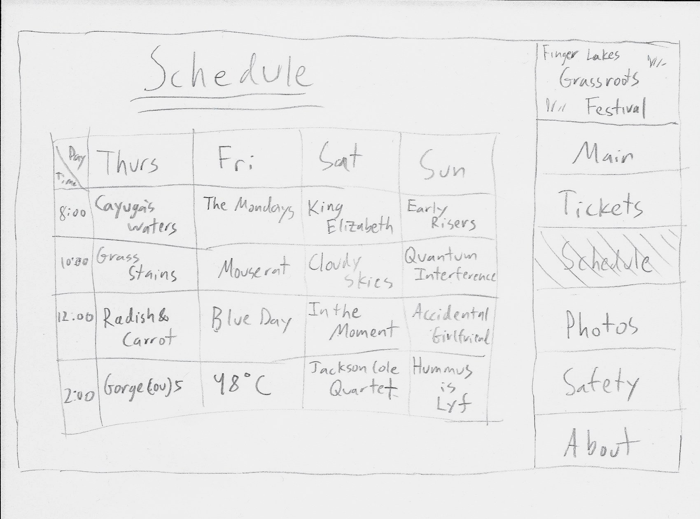

# Project 1 - Design Journey

**For each milestone, complete only the sections that are labeled with that milestone.**

## Markdown Instructions

This is a Markdown file. All written documents that you will submit this semester will be Markdown files. Markdown is a commonly used format by developers and bloggers. It's something that you should know.

The following links are Markdown references:
- <https://guides.github.com/features/mastering-markdown/>
- <https://github.com/adam-p/markdown-here/wiki/Markdown-Cheatsheet>

When writing your Markdown file in Atom. Open the command palette and search for **Markdown Preview: Toggle**. This will open up a panel in Atom where you can preview your formatted Markdown file.

This is how your insert images into your Markdown documents:

## Milestone 1

Make the case for your decisions using concepts from class, as well as other design principles, theories, examples, and cases from outside of class. You can use bullet points and lists, or full paragraphs, or a combo, whichever is appropriate. The writing should be solid draft quality but doesn't have to be fancy.

### Target Audience (Milestone 1)

[Briefly explain who the intended target audience(s) is(are) for your website.]

The intended target audience are people who want to learn more about me and what I have done with my life for two decades. Employers, friends, or people who simply want to learn more about me are my intended audience.

### Feel and Features (Milestone 1)

[Briefly describe the feel and features your site will have to cater to those audiences.]

I want the feel to be minimalistic while being visually aesthetic. I think the website should be simple, but intriguing. I want to add photos that show the audience who I am in a more objective way than words. I also want the website to be very accessible and easy to navigate, so that everyone can navigate the website easily and get to all of the information. I plan for the feel to be calm. I think that it would help the audience see what kind of person I am.

### Final Content (Milestone 1)

[Briefly describe the content you plan to include in the final submission, and why it's the right content for those audiences.]

I intend on including some of my past academic projects, as well as some projects I enjoyed doing outside of school so that my audience can see what I've been working on as well as some things I like to do in my free time. Also, I plan on having a short introduction on my website that would introduce the audience to myself.

## Milestone 2

Make the case for your decisions using concepts from class, as well as other design principles, theories, examples, and cases from outside of class.

Each section is probably around 1 reasonably sized paragraph (3-5 sentences).

### Target Audience (Milestone 2)

[A clearer description of audience: who are they, what are they interested in with respect to this site, and what are the design goals for that audience.]

My audience are people who want to learn more about me, what kind of person I am, what I have done with my life for the past twenty years. My audience would be interested in the academic projects that I've completed at school, and in the interests I have outside of school. They would also wonder what my brought me to do what I do today and how I grew to like these things. It is a website that serves for them to see what I find important to me and what I do with my life.

### Site Theme (Milestone 2)

[A description of your overall site theme and why it's appropriate for the audience.]

My overall theme is largely picture based. The pictures appropriately show pictures that I think represent my life and how I lived. More than words, the pictures show things I value and treasure. It shows things that make me happy and make me reminisce about my life. This would be good for my website because it gives me the opportunity to paint myself not only in distorted past memories, but in photos that capture the scene at a particular moment, whether good or bad.

### Navigation (Milestone 2)

[A description of how you generated and considered alternatives for the site's navigation.]

I used the navigation that we used in lab 2. I used an unordered list and linked the other pages in the list items. I also considered putting the navigation bar below the title, but I decided to put it above the title. I think this is the most efficient method to set up navigation between all of the pages. I used this method on each page of my website.

### Organization (Milestone 2)

[An explanation of how you came to the organization and content that you chose.]

I came to my current organization by thinking of what the audience would want to see about my life. I wanted to provide ample information about my life, without boring the audience. I decided to go with larger photos with less text, only enough text to describe the photo a bit. I wanted a simple introduction that shows my background.

## Milestone 3

Make the case for your decisions using concepts from class, as well as other design principles, theories, examples, and cases from outside of class.

Remember to focus on the things we can't see just by looking at the site: changes, alternatives considered, processes, and justifications.

Each section is probably around 1 reasonably sized paragraph (3-5 sentences).

### Changes from Milestone 2 (Milestone 3)

[What changes did you make from Milestone 2 to content/information/navigation, and why?]

I added a lot more content to all of the sections. I just expanded on all the sections since Milestone 2. All of the content shows projects or facets of myself that I consider important or worth letting others know about. I also organized my content from the past two milestones, so all of the content on each page is much more relevant. In terms of navigation, I kept everything pretty much the same. I tried to style a sticky header (similar to websites like facebook.com and twitter.com, social media sites that I frequent. The information that I have in the website is still the same, it is information about me.

### Visual Design (Milestone 3)

[Discuss your visual designs: how did you come to them, what are their strengths and weaknesses, how do they fit your overall design goals and audiences?]

I wanted my design to be visually appealing, yet simple. I made the theme blue, a universal color that makes users calm and relaxed. I tried other colors that I like (dark purple, black), but they didn't fit the theme of my website as well. Purple made my website too bright, and black made it too dark. I think the strength of my website is that it is simplistic and the colors suit the theme of the website. I think the photos fit well with the image I am trying to show the audience. It fits my overall design goals by reflecting myself and showing that image of myself to the audience. A weakness to my design is that it does not maintain the same style when the screen size is changing, but I am not sure how to fix this problem yet.

### Emotion (Milestone 3)

[Emotion is a big part of design. What emotions where you thinking about or trying to convey in your designs?]

I want to show a nostalgic and hopeful emotion in my website. I want to convey this because that is how my life has become and how it can possibly be in the future. I use colors and pictures in my website to portray these emotions. I want my audiences to feel these emotions when visiting my site as well.

## Final Submission - Rationale

This rationale should be polished writing: one you might submit as a report to a client or boss to help explain the project and convince them you did a good job. You'll be surprised how much writing and communicating you need to do about projects and choices on internships and jobs; practice that here.

It should be a comprehensive, complete story of the project. You might find that each section run several paragraphs (1-3). Sketches can often help tell the story of your design. Screenshots are also useful for describing issues discovered during user testing and how you addressed them. Quotes from your users during testing are also very powerful when explaining your rationale.

Your rationale should be a polished version of the earlier rationales.

### Changes from Milestone 3 (Final Submission)

- Changes since Milestone 3 and why, particularly ones you learned from testing.

I changed the formatting of the overall site by adding a sidebar on the left side of the site. I wanted to do this so that when the audience gets to a certain page, they can see the side bar,  and all the contents on the page. I implemented this because I thought it would be helpful for the structure of my website, and allow the audience easily get to a section that they wish to see. They can also click on a heading to go exactly to that page. By adding a sidebar, I had to shift all of the main content to the left of the page.

I experimented a lot with the sidebar, trying placing it on both sides of the screen, and even having it on the top of the website, near the navigation bar. I think having it on the left side makes the sidebar look much more clear and obvious to the user. When one hovers over a heading in the sidebar, it changes color to a darker blue to make it easier for the user to see what they are currently hovering over.

Here is the side bar on the left side of the website:

Through peer reviews, I realized that I did not have headings for each paragraph, so I added headings for each paragraphs. One peer reviewer told me that [she]" would center the titles of the images over the images themselves", so I decided to center the titles of the images, and ended up centering all the photos and photo captions as well, to make it more uniform. She mentioned that "since "brief intro" had both words capitalized, do that for "Places I've Lived" too", so I double checked the capitalization in all of the headings in my website. Another reviewer mentioned "also maybe like Yang Tan Institute you could include a brief summary for your other classes?", so I added more content for the other "projects" by describing the classes that I did those projects in. I put these in gray text, as it is not the main content of that page.

I added a little bit of extra content on the pages, to make the website more full and to add some more information in places that were a bit lacking. I also linked my email address, for audiences to contact me when they click on my email address at the footer. I also linked the website name back to the home page.

### Audience (Final Submission)

[A complete and polished description of the intended audience(s) for your website.]

The audience is someone learning more about me, employers, friends, or people I don't know that wish to learn about me. Even people that know me will probably learn get to learn something new about me through the site, as it is a site that shows different sides of me. I hope that through the website, the audience can see the personal and professional side of me. Through the projects page, the audience that wants to view my professional work can look through and see some of my school work, and through the "fun" page, they can see my hobbies outside of school. In the "about" page, they can learn a little about my story for the past two decades of my life. Depending on the person looking at the site, they can easily navigate to a different part of the site to learn what they are interesting in learning.

In the site, most of the sections are not lengthy, so I hope the audience can navigate to most sections of the website and learn more about me. I hope that anyone that is interested in me will be able to view the website and learn all they want to learn about me, what I like, what I do. It's like a resume, but more personal. Anyone who is wanting and willing to learn about me is my intended audience. The intended audience would be someone who just wants something short to look over and wants to enjoy their life. My intended audience is specifically friends/family, employers, and acquaintances who I meet and want to share my story with.

### Design Goals (Final Submission)

[An explanation of the design goals for that audience, based on your earlier rationales.]

I want to make the design simple and straightforward for the audience, so I chose a couple colors for the theme and made the navigation tools the consistent on each page of the website. Every time the audience needs to get to a different section on the website, they can hover over a link and it will change color, indicating that it will link to somewhere else on the site. When a link is clicked, the text is bolded and the user knows that it is selected. I made a sidebar so the audience can easily navigate on one page, and a navigation bar for the user to easily navigate across all four pages of the site.

I chose a neutral, blue color scheme because it suits the calm tone I want to portray throughout the site. Since the website is about me, I wanted to make the theme some of my favorite colors; I used to have a favorite color, but now I don't really have one. Since I think blue is generally a very calming color to the eye, so I wanted to stick with a couple of shades of blue throughout my site. I made most paragraphs (and the sidebar) have a white background so make the words in the paragraph (or sidebar) stand out more against the background. This would catch the attention of the audience and let them pay more attention to the words in the paragraph. The translation of the paragraphs that are not written in English are in gray text, so that the user can differentiate it with the content originally intended for the page. I wanted the introduction of me to mainly be through objective photos of myself and add some words to further explain myself, as I believe that photos tell more about a person than words, especially a well-chosen photo. The home and about page have a larger photo as an introduction to the content.

### Navigation (Final Submission)

[An explanation of how the final navigation met your goals and why its appropriate for your audience(s).]

By clicking on the title "Sophie's World" on any of the pages of the website, the user can easily get back to the home page, where I introduce myself very briefly. I implemented this idea because I saw that this was a common implementation among many other sites on the internet. Through the navigation bar at the top of the screen and the sidebar, the user can navigate to all pages and sections of the website easily. This is appropriate for my audience because it is simple and is not distracting when reading the content on my site. Since the audience has navigated websites before, the navigation for my website will be similar. Also, they can see all of the navigation options at all times, making their visit on my website quick and simple. Also, wherever the user is in the site, they have the ability to navigate anywhere they wish.

### Organization (Final Submission)

[An explanation of how the final organization met your goals and why its appropriate for your audience(s).]

My final organization consists of the main content on the right side, a, smaller, navigation sidebar on the left side, and a page navigation bar on the top that is fixed. Within the main content of the website, there are photos with figure captions, paragraphs, quotes (or short descriptions), headings, and unordered lists. These are used in the content depending on the topic of the content. This is appropriately organized because all of the organization is consistent across the sites and it makes it easy for the audience to interact with the site in the way that they wish: whether they want to look through the projects I've worked on in class, or whether they want to look at what I enjoy doing outside of school.

### Visual Design (Final Submission)

[An explanation of how the final design met your goals and why its appropriate for your audience(s).]

The design is very simple and consistent throughout the site, making it simple for the user to navigate the site. The navigation is clear when the user hovers over the links throughout the website to go to a different section in the website. There are larger photos on the pages that describe myself, so that the user can have a better visual as they are reading about me. I think these photos fit well with my image, as well as the image header quote. The quotes are from movies and books that I enjoy. The contents that I want to emphasize have a white background, other contents do not have a white background. The pictures shrink when the screen is readjusted. There is whitespace below the sidebar, that space allows the user to know that there is a side bar at the top. 

All these are appropriate for my audience to find information that they want to see and navigate my site with ease. Overall I wanted to give my site a melancholic and nostalgic feeling for my audience to feel. I added an adequate amount of pictures and words to express myself and how I view myself.
